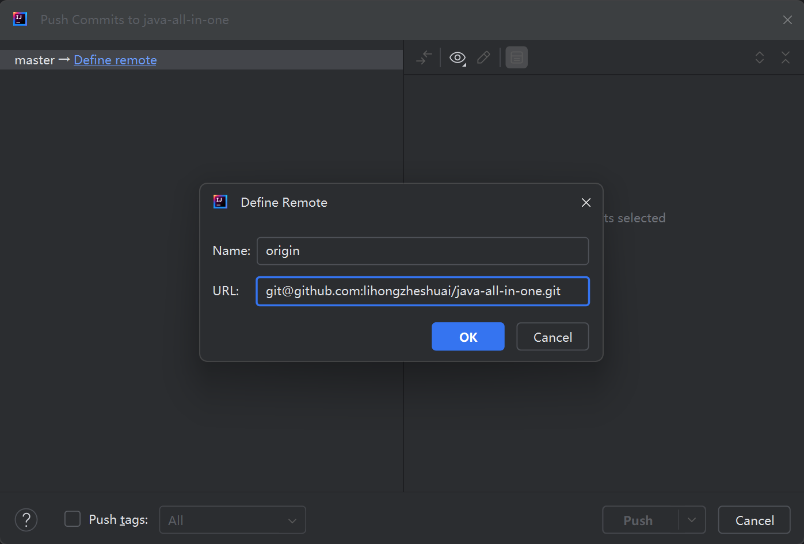

一时兴起，也为了便于跟大家同步学习进展和分享样例代码，遂决定创建一个全新的Java项目，并通过Github与大家分享。本文就是记录该项目的创建过程以及其中的一些知识要点（如Gradle等）。为了紧跟技术潮流和提高操作效率，本项目通过IDEA直接创建，用Gradle进行配置管理和用Git进行版本管理，并托管到Github上。Github地址为：[https://github.com/lihongzheshuai/java-all-in-one](https://github.com/lihongzheshuai/java-all-in-one)。

<!--more-->

### 一、通过IDEA创建一个Gradle管理的Java项目

通过IDEA创建Gradle项目非常简单，只需通过菜单"New->Project..."，然后输入项目名，选择Gradle配置即可，如图：

#### **几点说明如下：**

- Create Git repository:　就是该项目由Git进行版本管理，在本地创建Git Repo。
- Build system：指的是项目编译构建选择的工具环境，这里可选的是IntelliJ原生、Maven和Gradle，这里按按计划选择的Gradle，也是当前最新、流行的构建工具。这里，自然好奇Gradle和Maven的差异，**关于Gradle和Maven的差异对比，后续我们再详细学习，先记录一笔。**
- Gradle DSL: Gradle DSL（Domain Specific Language，领域特定语言）是Gradle使用的一种配置语言，用于定义构建脚本和构建逻辑。Gradle提供了两种DSL：Groovy DSL和Kotlin DSL。它们的主要作用是使构建脚本更加简洁、可读，并且可以利用编程语言的特性来实现复杂的构建逻辑。这里我们选择继续尝鲜**Kotlin**。同样，你应该也好奇**Kotlin和Groovy的差异**，这里也作为一个后续学习点，再记录一笔。
- Gradle distribution和Gradle version: 即使用的Gradle工具的来源和版本，这里选择IDEA内置的Gradle工具（也就是说我无需手动下载Gradle，IDEA已经自带了和最新的8.9版本。

点击Create后，稍作等待，一个Gradle项目就初始化完成了。目录结构如图：


至此，该项目已经可以使用了，按管理，我们写一个Hello World，中场庆祝一下。

```java
package com.coderli;

public class HelloWorldMain {
    public static void main(String[] args) {
        System.out.println("Hello World!");
    }
}
```

右键Run后，运行结果如下：

```text
17:44:42: Executing ':HelloWorldMain.main()'...

> Task :compileJava
> Task :processResources NO-SOURCE
> Task :classes

> Task :HelloWorldMain.main()
Hello World!

Deprecated Gradle features were used in this build, making it incompatible with Gradle 9.0.

You can use '--warning-mode all' to show the individual deprecation warnings and determine if they come from your own scripts or plugins.

For more on this, please refer to https://docs.gradle.org/8.9/userguide/command_line_interface.html#sec:command_line_warnings in the Gradle documentation.

BUILD SUCCESSFUL in 2s
2 actionable tasks: 2 executed
17:44:45: Execution finished ':HelloWorldMain.main()'.
```

这里，第一个小问题就出现了。从控制台输出来看，虽然成功输出了**Hello World!**，但也得到了一些警告信息。根据信息提示，我们需要增加--warning-mode all 参数，查看详细的警告信息。为了便于大家同步，我们将相关配置都统一配置到gradle.properties全局配置文件中。在项目根目录添加gradle.properties文件，里面添加配置：

```properties
org.gradle.warning.mode=all
```

再次运行程序，得到一些详细信息：

```text
> Configure project :
Initialization script 'C:\Users\lihongzhe\AppData\Local\Temp\HelloWorldMain_main__1.gradle': line 27
The org.gradle.api.plugins.Convention type has been deprecated. This is scheduled to be removed in Gradle 9.0. Consult the upgrading guide for further information: https://docs.gradle.org/8.9/userguide/upgrading_version_8.html#deprecated_access_to_conventions
 at HelloWorldMain_main__1_9tbxuij463am4a0xupi3ommf8$_run_closure1$_closure2.doCall$original(C:\Users\lihongzhe\AppData\Local\Temp\HelloWorldMain_main__1.gradle:27)
 (Run with --stacktrace to get the full stack trace of this deprecation warning.)
```

这里意思时说，org.gradle.api.plugins.Convention 类型在 Gradle 9.0 中即将被移除，因此你需要更新构建脚本，以避免使用已弃用的 API。在Gradle 9.0版本中 Convention API 将替换为新的 Extension API。而且问题出在HelloWorldMain_main__1.gradle这个文件的第27行。按路径找到自动生成的这个脚本文件:

```kotlin
    def gradlePath = ':'
    def runAppTaskName = 'HelloWorldMain.main()'
    def mainClassToRun = 'com.coderli.HelloWorldMain'
    def javaExePath = mapPath('C:/Program Files/Java/jdk-22/bin/java.exe')
    def _workingDir = mapPath('C:/Users/lihongzhe/IdeaProjects/java-all-in-one')

    def sourceSetName = 'main'
    def javaModuleName = null

    def isOlderThan64 = GradleVersion.current().baseVersion < GradleVersion.version("6.4")
    def isOlderThan33 = GradleVersion.current().baseVersion < GradleVersion.version("3.3")
    
    
    

    import org.gradle.util.GradleVersion

    allprojects {
      afterEvaluate { project ->
        def projectPath
        if (isOlderThan33) {
          projectPath = project.path
        } else {
          projectPath = project.identityPath.toString()
        }
        if(projectPath == gradlePath && project?.convention?.findPlugin(JavaPluginConvention)) {
          def overwrite = project.tasks.findByName(runAppTaskName) != null
          project.tasks.create(name: runAppTaskName, overwrite: overwrite, type: JavaExec) {
            if (javaExePath) executable = javaExePath
            if (isOlderThan64) {
              main = mainClassToRun
            } else {
              mainClass = mainClassToRun
            }
            args '--warning-mode'
args 'all'

            if (_workingDir) workingDir = _workingDir
            standardInput = System.in
            if (javaModuleName) {
              classpath = tasks[sourceSets[sourceSetName].jarTaskName].outputs.files + project.sourceSets[sourceSetName].runtimeClasspath;
              if (isOlderThan64) {
                doFirst {
                  jvmArgs += [
                    '--module-path', classpath.asPath,
                    '--module', javaModuleName + '/' + mainClassToRun
                  ]
                  classpath = files()
                }
              } else {
                mainModule = javaModuleName
              }
            } else {
              classpath = project.sourceSets[sourceSetName].runtimeClasspath
            }
          }
        }
      }
    }
```

果然在27行发现了废弃的convention相关代码：

```groovy
 if(projectPath == gradlePath && project?.convention?.findPlugin(JavaPluginConvention)) {
```

出于强迫着，就这个问题，我也搜索了很久。我虽然知道这个脚本是自动生成的，不过也试图看看有没有办法配置自动生成的配置，目前尚未找到解决方案，大胆猜测，随着Gradle升级到9.0版本，自动生成脚本的程序也应该随之修改吧。

暂且忽略该警告，我们就初步完成了一个通过Gradle配置的项目的初始化。通过IDEA中的Git插件，配置远端地址后，将初始化代码推送到Github上。



至此，第一步启动工作就算暂且完成了。这里其实遗留了很多细小但我觉得相对有趣的点准备下一步细细研究分享，如：
1. 初始化项目中有很很多配置文件，每个配置文件的定位和作用是什么？
2. 对于这类项目的协作，在.gitignore中究竟配置哪些路径和文件？为什么？比如目前我还将.idea文件夹中的文件按默认配置纳入git版本管理，是否应该这样？
3. 起步阶段，通过Gradle编译的项目应该执行的task有哪些？

问题很多，慢慢研究。一起起步吧。