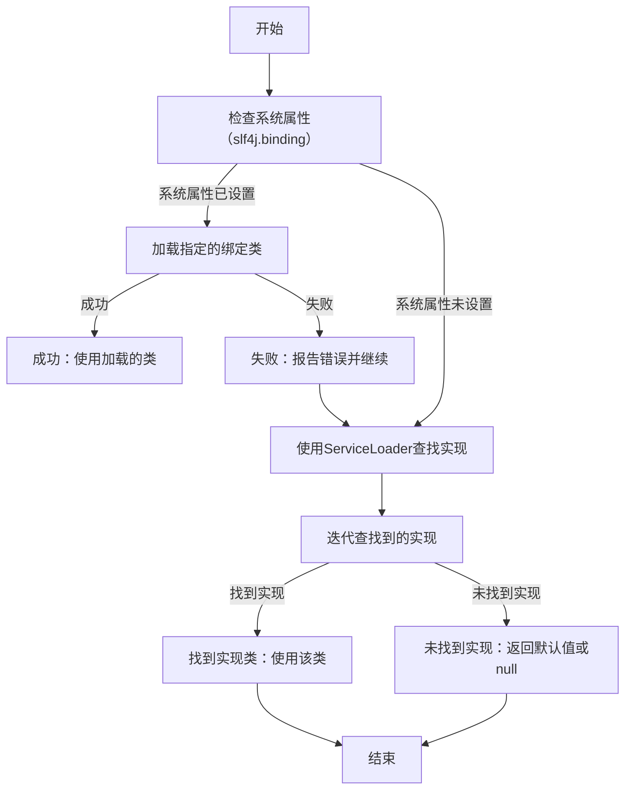

最近各种事情很忙，今天继续。在第十篇([***一起学Java(10)-为项目引入Log框架(Log篇二-引入SLF4J接口层框架)***](https://www.coderli.com/java-go-9-import-log-one/))中，我们为项目([https://github.com/lihongzheshuai/java-all-in-one])(https://github.com/lihongzheshuai/java-all-in-one)引入了`SLF4J`和`Logback`框架，按计划通过阅读源码研究下`SLF4J`的实现原理。

<!--more-->

## 一、配置Gradle自动下载源码和Javadoc

为了便于的**IDEA**中自动绑定并阅读源码，首先配置Gradle的idea插件，在更新下载依赖的时候自动下载源码和Javadoc，修改`build.gradle.kts`文件，引入并配置`idea`插件：

```kotlin
plugins {
    id("java")
    id("idea")
}

allprojects {
    group = "com.coderli"
    version = "0.1"
}

subprojects {

    apply(plugin = "java")
    apply(plugin = "idea")

    idea {
        module {
            isDownloadSources = true // 下载源码
            isDownloadJavadoc = true // 下载 Javadoc
        }
    }

    dependencies {
        implementation("org.slf4j:slf4j-api:2.0.16")
        implementation("ch.qos.logback:logback-classic:1.5.6")
    }

    repositories {
        maven("https://maven.aliyun.com/repository/public")
        maven("https://mirrors.cloud.tencent.com/nexus/repository/maven-public/")
        mavenCentral()
    }

}
```

刷新项目后，依赖对应的源码即下载并帮定完成。点击进入第三方包的代码后，会直接显示源码而不是反编译的结果。可读性更强。


## 二、源码解读SLF4J如何寻找Log实现层框架

### (一) 未引入应用层Log框架时的实现逻辑

上文中([***一起学Java(10)-为项目引入Log框架(Log篇二-引入SLF4J接口层框架)***](https://www.coderli.com/java-go-9-import-log-one/))，在未引入Logback应用层框架的时候，打印日志时控制台输出：

```plaintext
SLF4J(W): No SLF4J providers were found.
SLF4J(W): Defaulting to no-operation (NOP) logger implementation
SLF4J(W): See https://www.slf4j.org/codes.html#noProviders for further details.
```

以找到这个原因为目标，启动研究。




喝酒，走肾
写码，走心