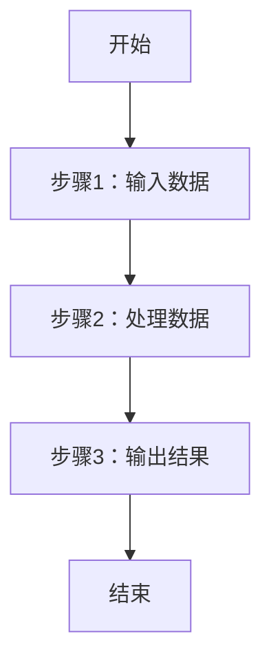
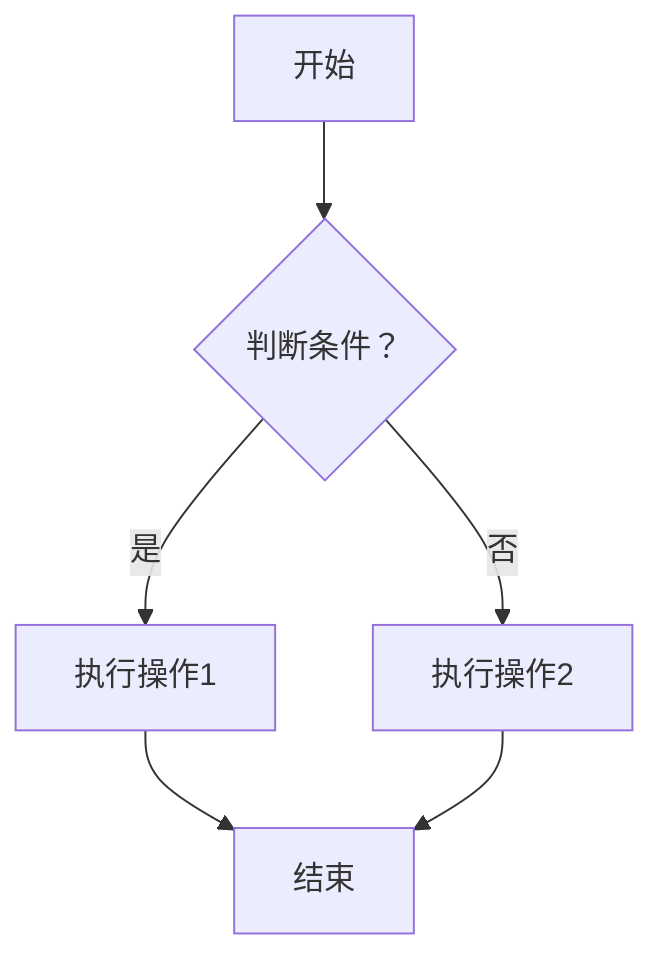
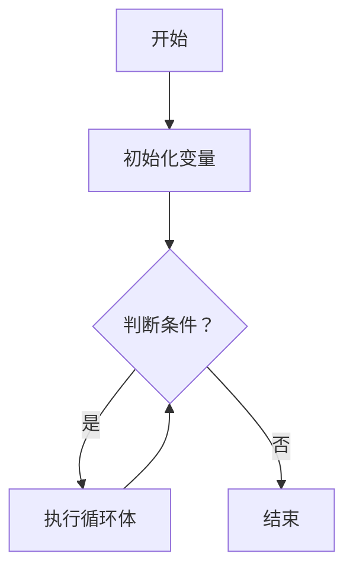
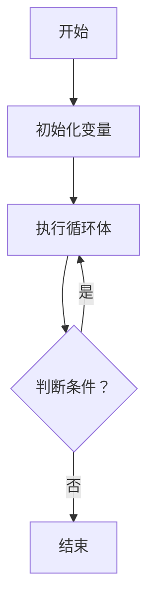
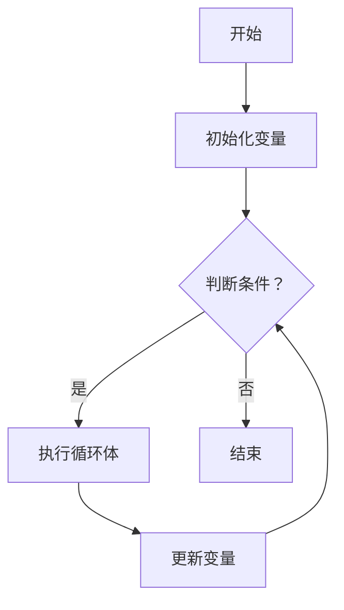
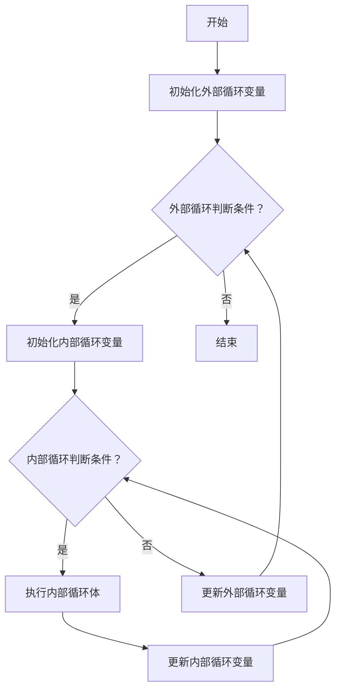
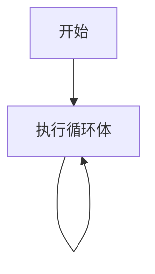

GESP C++二级官方考试大纲中，共有9条考点，本文针对C++（4）号知识点进行总结梳理。
>（4）了解流程图的概念及基本表示符号，掌握绘制流程图的方法，能正确使用流程图描述程序设计的三种基本结构。

<!--more-->

流程图是一种使用特定符号和连接线来直观表示算法、过程或系统工作流程的图示工具。它通过图形化的方式展示各步骤的顺序和逻辑关系，广泛应用于程序设计、业务流程分析等领域。

## **一、了解流程图的概念及基本表示符号，掌握绘制流程图的方法**

在绘制流程图时，常用的基本符号及其含义如下：

1. **起止符（开始/结束）**：椭圆形符号，表示流程的起点或终点。
2. **处理符（操作）**：矩形符号，表示具体的操作步骤或处理过程。
3. **判断符（决策）**：菱形符号，表示需要进行判断或决策的步骤，通常有两个或多个出口，分别对应不同的判断结果。
4. **输入/输出符**：平行四边形符号，表示数据的输入或输出操作。
5. **连接符**：小圆圈或其他标记，表示流程图中不同部分的连接，常用于流程图过长或跨页时的连接。
6. **流程线**：带箭头的直线，表示流程的执行方向和步骤之间的连接。

### 绘制流程图的方法

1. **明确流程目的**：确定需要描述的流程或算法的目标和范围。
2. **列出主要步骤**：将流程的主要步骤按顺序罗列，明确每一步的操作内容。
3. **选择合适的符号**：根据每个步骤的性质，选择对应的流程图符号。
4. **绘制流程图**：按照步骤顺序，将符号连接起来，使用箭头指示流程方向。
5. **验证和优化**：检查流程图的逻辑性和完整性，确保无遗漏或错误，并根据需要进行优化。



---

## **二、能正确使用流程图描述程序设计的三种基本结构**

程序设计的三种基本结构是**顺序结构**、**选择结构**和**循环结构**。通过流程图能够清晰直观地表达这三种基本结构。下面分别介绍每种结构的使用方法。

### **（一）顺序结构**

顺序结构是程序执行的最基本结构，指按照语句出现的顺序，从上到下依次执行。

**特点：**

- 没有任何判断和分支。
- 适用于简单的直线流程。

---

### **（二）选择结构**

选择结构是一种包含条件判断的流程，程序根据条件的真假，选择执行不同的路径。

**特点：**

- 必须包含一个判断条件。
- 通常有两条或多条分支路径。

---

### **（三）循环结构**

循环结构是程序的一种重复执行机制，通过满足某种条件来决定是否进入下一次循环。

**特点：**

- 包含循环条件判断。
- 循环体可以重复执行。

以下是几种常见的循环结构的流程图示意，包括 **`while` 循环**、**`do-while` 循环** 和 **`for` 循环**等

#### 1. **`while` 循环**

`while` 循环首先判断条件是否满足，如果满足则执行循环体，否则跳出循环。

- 在`while`循环中，判断条件位于循环开始之前。
- 如果条件不满足，直接跳出循环。

#### 2. **`do-while` 循环**

`do-while` 循环与 `while` 循环的主要区别是，`do-while` 会先执行一次循环体，再判断条件。

- 循环体至少会执行一次。
- 在 `do-while` 循环中，判断条件是位于循环体之后。

---

#### 3. **`for` 循环**

`for` 循环通常用于已知循环次数的情况，通过初始化、条件判断和更新三个步骤来控制循环。

- `for` 循环通常包括三部分：初始化变量、判断条件和更新变量。
- `for` 循环适用于已知循环次数或有明确终止条件的情况。

#### 4. **嵌套循环**

嵌套循环是指在一个循环体内再包含一个循环。

- 外部循环每次迭代时，内部循环会从头开始执行。
- 外部循环和内部循环通常有不同的终止条件。

#### 5. **无限循环**

无限循环是一个没有退出条件的循环，通常通过手动干预或程序中的其他条件来终止。

- 这个流程表示的是一个没有条件判断的循环，通常在实际应用中会结合 `break` 或其他机制来终止。

#### 小结

- `while` 循环：首先判断条件，满足条件后进入循环体。
- `do-while` 循环：先执行一次循环体，再判断条件。
- `for` 循环：初始化、判断条件、更新变量，通过这三部分来控制循环。
- 嵌套循环：外层和内层循环嵌套执行。
- 无限循环：没有终止条件的循环。

这些流程图示意可以帮助你更好地理解循环结构的工作原理，你可以将它们应用于不同的编程场景。

---

## **三、总结**

至此，GESP C++二级考纲中涉及基础知识的考点1-4，都已经梳理完成了，剩下的5-9都是针对C++编程的，通过习题练习即可，后续不再赘述。

---

