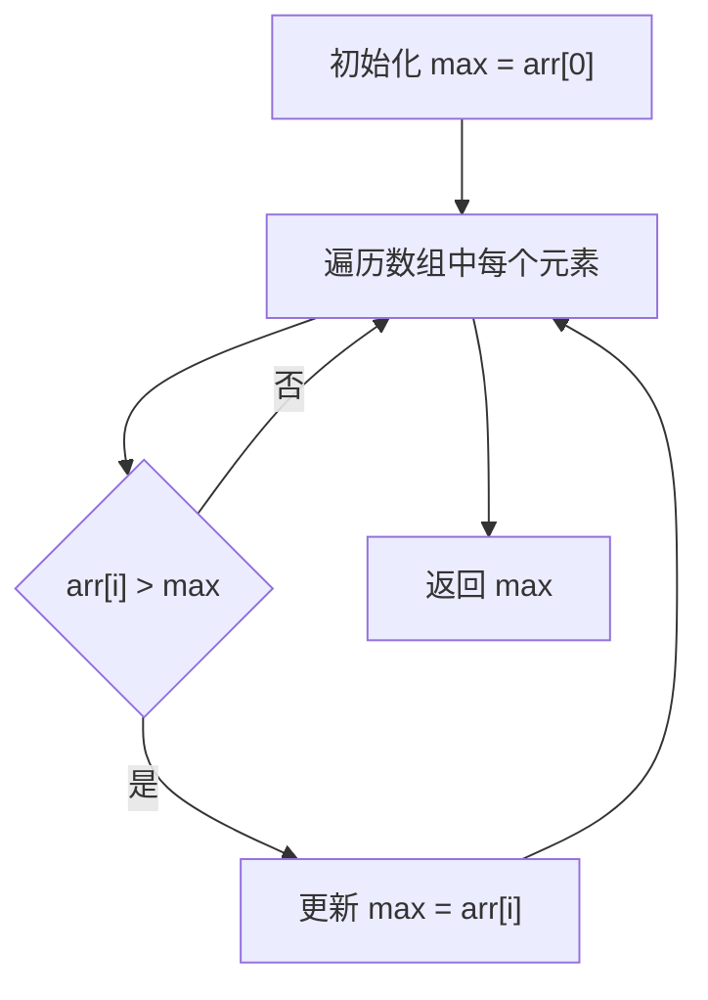

GESP C++三级官方考试大纲中，共有8条考点，本文针对C++（4）号知识点进行总结梳理。
> （4）了解算法的概念与描述，熟练运用自然语言、流程图、伪代码方式来描述算法。

<!--more-->

## **一、算法的概念**

算法（Algorithm）是一个精确的、定义明确的步骤集合，用来解决某个特定问题或完成某项任务。每个算法都有明确的输入和输出，通过一系列操作，最终得到期望的结果。算法是计算机科学中的核心概念之一，也是计算机程序设计的基础。

### **（一）算法的基本特征**

一个算法通常具有以下基本特征：

1. **输入（Input）**：
   - 算法开始时，必须接受一个或多个输入。输入数据可以是从外部环境中获取的（如用户输入、文件读入、网络请求等）。

2. **输出（Output）**：
   - 每个算法都应该有至少一个输出，即经过一系列步骤处理后，所得到的结果。

3. **明确性（Finiteness）**：
   - 算法的每个步骤必须是明确的、可执行的，不存在歧义。即每个步骤都必须是清晰地描述的，不需要进一步解释。

4. **有穷性（Termination）**：
   - 算法必须保证在有限步数后结束，不会陷入无限循环。算法总能在有限的时间内结束，并且有明确的输出。

5. **可行性（Effectiveness）**：
   - 算法的每个步骤都必须是可执行的，即在有限的资源下能够通过计算机完成。算法中使用的操作必须是可以实际执行的。

6. **通用性（Generality）**：
   - 算法应具有一定的通用性，能够处理多种输入情况，而不仅仅是为某个特定的实例量身定做。

### **（二）算法的分类**

根据不同的标准，算法可以分为以下几类：

1. **按功能分类：**
   - **排序算法**：如快速排序、归并排序、冒泡排序等，用于将数据按一定顺序排列。
   - **查找算法**：如二分查找、线性查找等，用于在数据集合中寻找特定元素。
   - **图算法**：如深度优先搜索（DFS）、广度优先搜索（BFS）、Dijkstra算法等，用于图的遍历与最短路径计算。
   - **动态规划**：如背包问题、最长公共子序列问题等，利用子问题的最优解来构建更大问题的最优解。

2. **按解决问题的方式分类：**
   - **分治算法**：将一个问题分解成多个小问题，通过解决小问题来合成原问题的解。例如归并排序和快速排序。
   - **贪心算法**：每一步都选择当前看来最优的解决方案，不一定能获得全局最优解，但在许多问题中，贪心算法能得到接近最优的解。
   - **回溯算法**：通过枚举所有可能的解，并在遇到不满足条件的情况下返回上一步，撤销之前的决策，继续搜索其他解。
   - **动态规划**：将一个复杂问题拆解成多个较小的子问题，记录已计算的子问题的解，并通过这些解来构建问题的解。

3. **按时间复杂度分类：**
   - **线性算法**：时间复杂度为O(n)，随着输入规模n线性增长。例：线性查找。
   - **对数算法**：时间复杂度为O(log n)，例：二分查找。
   - **多项式时间算法**：时间复杂度为O(n²)、O(n³)等，例如冒泡排序、插入排序等。
   - **指数算法**：时间复杂度为O(2^n)，通常是暴力破解类问题，例如旅行商问题。

---



## **二、运用自然语言、流程图、伪代码方式来描述算法**

熟练运用自然语言、流程图、伪代码等方式来描述算法，是计算机科学和软件开发中非常重要的技能。下面是对这三种描述方式的简单介绍与应用：

### **（一）自然语言描述**

自然语言描述算法是最直观的一种方式，适合向非技术人员或对某个问题不熟悉的人员说明算法的思路。

**特点：**

- 用通俗易懂的语言表达。
- 适合表达算法的整体思路。
- 容易引起歧义或不严谨，尤其是处理复杂逻辑时。

**示例：**
假设我们要描述一个求数组最大值的算法。

**自然语言描述：**

1. 初始化一个变量`max`为数组的第一个元素。
2. 遍历数组中的每个元素，如果当前元素比`max`大，则更新`max`的值。
3. 返回`max`作为数组中的最大值。

### **（二）流程图描述**

流程图通过图形化的方式展示算法的执行流程，适合清晰、直观地呈现每一步操作。

**特点：**

- 视觉化效果好，能帮助理解复杂的逻辑。
- 适用于流程较为清晰且步骤固定的算法。

**示例：**
对于求数组最大值的算法，流程图如下所示：



### **（三）伪代码描述**

伪代码是介于自然语言和程序代码之间的一种描述方式，既具有一定的结构性，又能避免过多语言细节，适合快速描述算法逻辑。

**特点：**

- 结构清晰、简洁，适合表达较为复杂的算法。
- 不依赖于某一种编程语言，能很好地展示逻辑。

**示例：**
对于求数组最大值的伪代码描述：

```javascript
function findMax(arr):
    max = arr[0]        // 初始化max为数组的第一个元素
    for each element x in arr:
        if x > max:
            max = x    // 更新max为更大的值
    return max
```

### **（四）小结**

- **自然语言**：适合高层次的说明，简洁明了，但容易含糊。
- **流程图**：适合复杂算法的可视化，直观清晰。
- **伪代码**：结构化、简洁，适合表达细节和算法的步骤。

每种方式都有其独特的优点，实际应用中常常需要根据受众和算法复杂度选择合适的描述方式。

---

