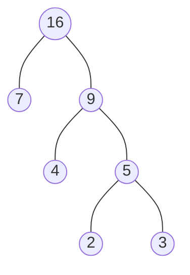
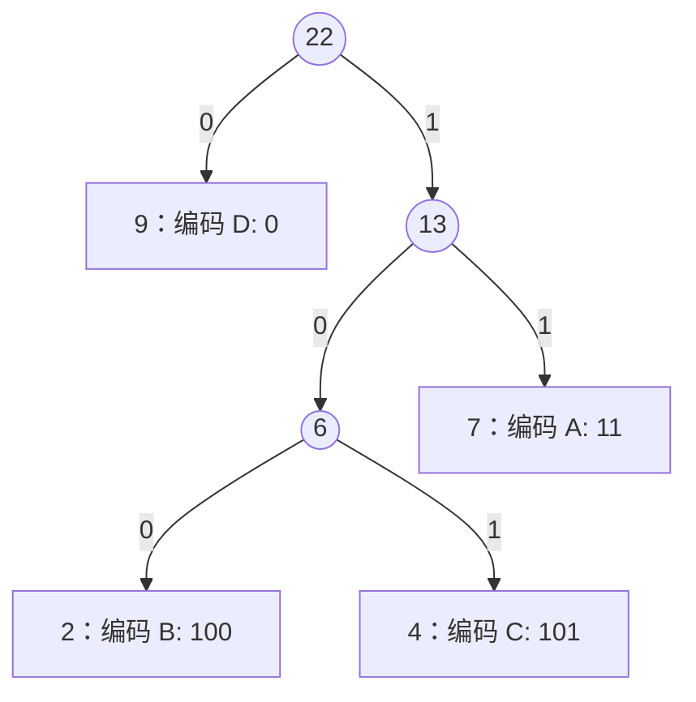
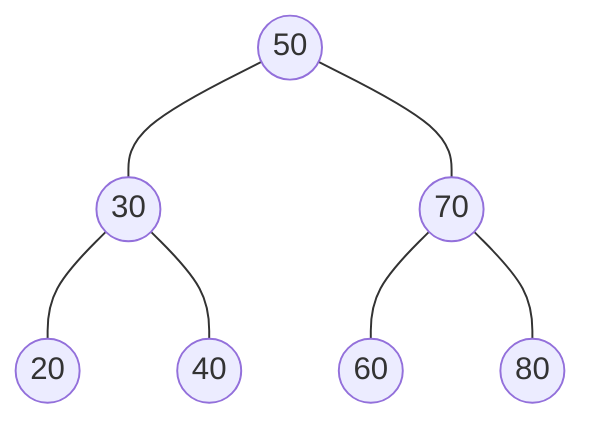

GESP C++六级官方考试大纲中，第`2`条考点要求深入掌握几种特殊的树形结构。

> （2）掌握哈夫曼树、完全二叉树、二叉排序树的相关概念和应用。
{: .prompt-info}

> 本人也是边学、边实验、边总结，且对考纲深度和广度的把握属于个人理解。因此本文更多的不是一个教程，而是个人知识梳理，如有遗漏、疏忽，欢迎指正、交流。
{: .prompt-warning}

***六级考点系列：***

> * [【GESP】C++六级考试大纲知识点梳理, (1) 树的概念与遍历](https://www.coderli.com/gesp-6-exam-syllabus-1-tree/)
{: .prompt-tip}

本篇将详细讲解这三种特殊树的定义、性质及在编程竞赛中的常见应用。

<!--more-->

---

## 一、完全二叉树 (Complete Binary Tree)

在上一篇([【GESP】C++六级考试大纲知识点梳理, (1) 树的概念与遍历](https://www.coderli.com/gesp-6-exam-syllabus-1-tree/))中我们已经介绍了完全二叉树的定义，这里重点关注其**性质与应用**。

### 1.1 核心性质回顾

完全二叉树是指前 $k-1$ 层满，第 $k$ 层节点集中在左侧的二叉树。它最适合用 **数组(顺序存储)** 来表示。

对于一个从下标 `1` 开始存储的完全二叉树，若节点下标为 `i`：

* **父节点**：`i / 2` (若 `i=1` 则无父节点)
* **左孩子**：`2 * i` (若 `2*i > n` 则无左孩子)
* **右孩子**：`2 * i + 1` (若 `2*i + 1 > n` 则无右孩子)

### 1.2 应用：堆 (Heap)

完全二叉树最典型的应用就是**堆**。

* **大根堆 (Max Heap)**：每个节点的值都 $\ge$ 其子节点的值。堆顶是最大值。
* **小根堆 (Min Heap)**：每个节点的值都 $\le$ 其子节点的值。堆顶是最小值。

堆常用于实现**优先队列 (Priority Queue)**，在 $O(\log n)$ 时间内插入元素或删除最值。

---

## 二、哈夫曼树 (Huffman Tree)

### 2.1 基本概念

* **路径长度**：从一个节点到另一个节点的分支数量。
* **节点的带权路径长度**：从根节点到该节点的路径长度 $\times$ 该节点的权值。
* **树的带权路径长度 (WPL)**：所有**叶子节点**的带权路径长度之和。

**哈夫曼树**（也称最优二叉树）是给定 $n$ 个权值作为 $n$ 个叶子节点，构造出的**WPL 最小**的二叉树。

### 2.2 构造过程（哈夫曼算法）

**贪心策略**：每次从森林中选取两棵根节点权值最小的树作为左右子树，构造一棵新树，新树根节点的权值为左右子树根节点权值之和。

**示例**：给定权值 $\{2, 3, 4, 7\}$

1. 选最小的 $2, 3$，合并为 $5$。剩余 $\{4, 7, 5\}$。
2. 选最小的 $4, 5$，合并为 $9$。剩余 $\{7, 9\}$。
3. 选最小的 $7, 9$，合并为 $16$。结束。



### 2.3 应用：哈夫曼编码 (Huffman Coding)

哈夫曼编码是一种广泛用于数据压缩的编码算法（如 ZIP 压缩、JPEG 图片格式中都有用到）。它的核心逻辑紧密依赖于哈夫曼树的结构。

#### 1. 为什么需要哈夫曼编码？

在计算机中，标准的 ASCII 编码是**定长编码**，每个字符都占用 8 位（1字节）。但如果我们观察到某些字符出现的频率远高于其他字符（例如英文中 'e' 出现最多，'z' 出现很少），那么给高频字符分配更短的编码（例如 3 位），给低频字符分配较长的编码（例如 10 位），总的存储空间就会大大减少。这就是**变长编码**的核心思想。

#### 2. 核心逻辑与树的关系

哈夫曼编码采用了**贪心策略**，通过构建哈夫曼树来实现：

* **频率决定深度**：字符的频率作为叶子节点的**权值**。在构建过程中，频率越小的节点越早被合并（处于树的底层），路径越长，编码越长；频率越大的节点越晚被合并（靠近根节点），路径越短，编码越短。
* **路径决定编码**：规定哈夫曼树的**左分支代表 `0`**，**右分支代表 `1`**。从**根节点**出发，走到某个字符所在的**叶子节点**，路径上经过的 `0` 和 `1` 序列就是该字符的哈夫曼编码。
* **天然的前缀性质**：**前缀编码**是指没有任何一个字符的编码是另一个字符编码的前缀（避免解码歧义）。在哈夫曼树中，所有字符都位于**叶子节点**。从根到任一叶子的路径，绝不可能是到另一叶子路径的前缀（因为路径必须到达叶子才结束）。因此，哈夫曼树天然满足前缀编码的要求。

#### 3. 实例演示

假设有 4 个字符，频率如下：`A: 7`, `B: 2`, `C: 4`, `D: 9`。

**构建步骤**：

1. **初始森林**：将每个字符视为一棵树，权值为其频率：`{B:2}, {C:4}, {A:7}, {D:9}`。
2. **第一次合并**：选择权值最小的 `{B:2}` 和 `{C:4}`。合并成新树 `Node(6)`。我们将 `{B:2}` 作为左孩子 (0)，`{C:4}` 作为右孩子 (1)。森林变为：`{Node(6):6}, {A:7}, {D:9}`。
3. **第二次合并**：选择权值最小的 `{Node(6):6}` 和 `{A:7}`。合并成新树 `Node(13)`。我们将 `{Node(6):6}` 作为左孩子 (0)，`{A:7}` 作为右孩子 (1)。森林变为：`{D:9}, {Node(13):13}`。
4. **第三次合并**：选择权值最小的 `{D:9}` 和 `{Node(13):13}`。合并成根节点 `Root(22)`。我们将 `{D:9}` 作为左孩子 (0)，`{Node(13):13}` 作为右孩子 (1)。

**生成的树结构与编码（左分支 0，右分支 1）**：



可以看到，频率最高的 D(9) 编码最短（1位），频率最低的 B(2) 编码最长（3位）。这正是哈夫曼编码通过变长编码实现数据压缩的原理。

**C++ 实现思路**：

通常使用 `std::priority_queue`（小根堆）来辅助构造哈夫曼树并计算 WPL。

```cpp
#include <iostream>
#include <queue>
#include <vector>
using namespace std;

int main() {
    // 小根堆：总是自动把最小的权值放在堆顶，方便我们每次取最小的两个
    priority_queue<int, vector<int>, greater<int>> pq;
    pq.push(2); pq.push(3); pq.push(4); pq.push(7);

    int wpl = 0;
    
    // 核心贪心逻辑：只要森林中还有多于一棵树，就继续合并
    while (pq.size() > 1) {
        // 1. 取出两个最小的权值（贪心策略：频率越小越早合并）
        int a = pq.top(); pq.pop(); // 最小
        int b = pq.top(); pq.pop(); // 次小
        
        // 2. 合并产生新节点，新权值为两者之和
        int sum = a + b;
        
        // 3. 统计代价：WPL 等于所有非叶子节点的权值之和
        // 每次合并都会产生一个非叶子节点，其权值为 sum，将其累加
        wpl += sum; 
        
        // 4. 将新合成的节点放回堆中，参与后续的合并过程
        pq.push(sum);
    }
    
    cout << "WPL = " << wpl << endl; // 计算结果应为 36
    return 0;
}
```

---

## 三、二叉排序树 (Binary Search Tree, BST)

### 3.1 定义

二叉排序树（也叫二叉搜索树）或者是一棵空树，或者是具有下列性质的二叉树：

1. 若左子树不空，则**左子树上所有节点的值均小于**它的根节点的值；
2. 若右子树不空，则**右子树上所有节点的值均大于**它的根节点的值；
3. 左、右子树也分别为二叉排序树。

**重要性质**：二叉排序树的**中序遍历**序列是一个**升序序列**。

### 3.2 常见操作

* **查找**：从根开始，小往左走，大往右走。平均时间复杂度 $O(\log n)$，最坏 $O(n)$（退化为链）。
* **插入**：类似查找，找到空位置插入。



### 3.3 C++ 代码示例

```cpp
#include <iostream>
using namespace std;

struct TreeNode {
    int val;
    TreeNode *left, *right;
    TreeNode(int x) : val(x), left(NULL), right(NULL) {}
};

// 插入节点：递归找到合适的空位置
TreeNode* insertBST(TreeNode* root, int val) {
    // 1. 递归终止条件：找到了空位，创建新节点并返回
    if (root == NULL) return new TreeNode(val);
    
    // 2. 根据 BST 性质（左<根<右）决定递归方向
    if (val < root->val)
        root->left = insertBST(root->left, val); // 比根小，去左子树插
    else if (val > root->val)
        root->right = insertBST(root->right, val); // 比根大，去右子树插
    
    return root; // 返回当前节点，保持父子连接关系
}

// 查找节点：利用二叉排序树特性进行“二分”查找
TreeNode* searchBST(TreeNode* root, int val) {
    // 找到了 或者 找遍了也没找到
    if (root == NULL || root->val == val) return root;
    
    // 如果目标值小于当前节点值，说明目标只可能在左子树
    if (val < root->val) return searchBST(root->left, val);
    // 否则在右子树
    else return searchBST(root->right, val);
}

// 中序遍历验证：BST 的中序遍历一定是有序序列
void inOrder(TreeNode* root) {
    if (root == NULL) return;
    inOrder(root->left);       // 左
    cout << root->val << " ";  // 根
    inOrder(root->right);      // 右
}

int main() {
    TreeNode* root = NULL;
    int nums[] = {50, 30, 70, 20, 40, 60, 80};
    for(int x : nums) root = insertBST(root, x);
    
    cout << "BST 中序遍历: ";
    inOrder(root); // 输出: 20 30 40 50 60 70 80
    cout << endl;
    
    TreeNode* found = searchBST(root, 40);
    if(found) cout << "Found: " << found->val << endl;
    else cout << "Not Found" << endl;
    
    return 0;
}
```



---

## 四、总结

| 树类型 | 关键特征 | 典型应用 |
| :--- | :--- | :--- |
| **完全二叉树** | 结构紧凑，数组存储 | 堆 (Heap)、优先队列 |
| **哈夫曼树** | 带权路径长度最小 | 数据压缩 (Huffman Coding) |
| **二叉排序树** | 左 < 根 < 右 | 高效查找、去重、排序 |

---


