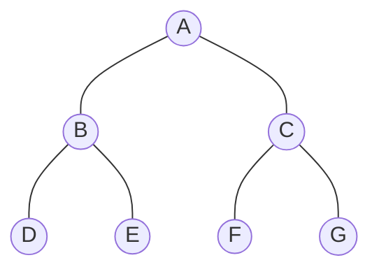

GESP C++六级官方考试大纲中，第`4`条考点要求掌握核心的搜索算法及其应用。

> （4）掌握深度优先搜索算法（DFS）、宽度优先搜索算法（也称广度优先搜索算法，BFS）、二叉树的搜索算法的概念及应用，能够根据现实问题，选择合适的搜索算法。
{: .prompt-info}

> 搜索算法是计算机解决“怎么走”、“怎么找”问题的核心工具，也是从C++五级迈向六级、七级乃至算法竞赛的必经之路。本文将用通俗的语言梳理这两种基础搜索算法的原理、区别及适用场景。
{: .prompt-warning}

> 本人也是边学、边实验、边总结，且对考纲深度和广度的把握属于个人理解。因此本文更多的不是一个教程，而是个人知识梳理，如有遗漏、疏忽，欢迎指正、交流。
{: .prompt-warning}

***六级考点系列：***

> * [【GESP】C++六级考试大纲知识点梳理, (1) 树的概念与遍历](https://www.coderli.com/gesp-6-exam-syllabus-1-tree/)
> * [【GESP】C++六级考试大纲知识点梳理, (2) 哈夫曼树、完全二叉树与二叉排序树](https://www.coderli.com/gesp-6-exam-syllabus-2-huffman-bst/)
> * [【GESP】C++六级考试大纲知识点梳理, (3) 哈夫曼编码与格雷码](https://www.coderli.com/gesp-6-exam-syllabus-3-huffman-gray/)
{: .prompt-tip}

搜索，简单来说，就是在一个数据集合（如图、树或状态空间）中，按照某种规则寻找特定目标（如终点、最大值、解）的过程。最基础也是最重要的两种搜索策略，就是 **DFS** 和 **BFS**。

<!--more-->

---

## 一、深度优先搜索 (DFS)

### 1.1 核心概念：不撞南墙不回头

**深度优先搜索** (Depth-First Search, DFS) 的策略非常直观，就像走迷宫：
选定一条路，一直走下去，直到走不通（遇到死胡同或已访问过的节点）为止。一旦走不通，就**回溯**（Backtrack）到上一个路口，选择另一条没走过的路继续尝试。

**口诀**：**“一条道走到黑，走不通退回来。”**

* **数据结构**：通常使用 **栈 (Stack)**。
* **实现方式**：最常用 **递归 (Recursion)** 实现，系统会自动维护函数调用栈。

### 1.2 执行过程图解

假设我们要在下面的树中搜索：



**DFS 的访问顺序（假设先左后右）**：

1. 从 **A** 出发，有路就走，先去 **B**。
2. 从 **B** 出发，先去 **D**。
3. **D** 是死胡同，**回溯** 到 B。
4. **B** 还有另一条路 **E**，去 **E**。
5. **E** 是死胡同，**回溯** 到 B，B 的路走完了，**回溯** 到 A。
6. **A** 还有另一条路 **C**，去 **C**。
7. ...以此类推。

**最终序列**：A -> B -> D -> E -> C -> F -> G

### 1.3 适用场景

* **寻找所有解**：如全排列、组合生成。
* **连通性判断**：判断图中两点是否连通。
* **回溯类问题**：如八皇后问题、数独求解。

### 1.4 代码示例

```cpp
#include <iostream>
#include <vector>

const int MAX_N = 1005;      // 最大节点数，根据题目范围设定
bool visited[MAX_N];         // 访问标记数组：visited[i] = true 表示节点 i 已被访问
std::vector<int> adj[MAX_N]; // 邻接表：adj[u] 保存节点 u 的所有直接邻居

// 深度优先搜索函数
void dfs(int u) {
    visited[u] = true; // 1. 标记当前节点已访问，防止重复访问导致死循环
    // std::cout << u << " "; //在此处进行节点处理逻辑（例如输出、计数等）
    
    // 2. 遍历节点 u 的所有相邻节点 v
    // (这里使用了 C++11 的范围 for 循环，等价于遍历 adj[u] 这个向量)
    for (int v : adj[u]) {
        // 3. 关键判断：只有未被访问过的邻居才去访问
        if (!visited[v]) {
            dfs(v); // 4. 递归调用：这是 DFS 的核心，深入下一层
        }
    }
}
```

**代码解读**：

* `adj` 是**邻接表**，是图论中最常用的存储方式。`adj[1] = {2, 3}` 表示节点 1 连接着节点 2 和 3。
* `visited` 数组至关重要，它充当“备忘录”，防止程序在环路中无限打转（比如 A 走到 B，B 又走回 A）。
* `dfs(v)` 的递归调用体现了“深度优先”：程序会挂起当前的 `dfs(u)`，优先去执行更深层的 `dfs(v)`，直到 `v` 的路走完才会回到 `u`。

---

## 二、宽度优先搜索 (BFS)

### 2.1 核心概念：层层推进，地毯式搜索

**宽度优先搜索** (Breadth-First Search, BFS)，也叫广度优先搜索。它的策略像平静的水面上扔一颗石子，波纹一圈圈向外扩散。

它会先访问起点的所有**直接邻居**（第1层），然后再访问所有邻居的邻居（第2层），以此类推。

**口诀**：**“稳扎稳打，层层推进。”**

* **数据结构**：必须使用 **队列 (Queue)**。
* **实现方式**：利用队列“先进先出”的特性，保证先遇到的节点先扩展。

### 2.2 执行过程图解

还是同样的树：


**BFS 的访问顺序**：

1. **第0层**：访问起点 **A**。
2. **第1层**：访问 A 的所有邻居 **B, C**。
3. **第2层**：访问 B 的邻居 **D, E**，接着访问 C 的邻居 **F, G**。

**最终序列**：A -> B -> C -> D -> E -> F -> G

### 2.3 适用场景

* **最短路径问题**：在**无权图**（每条边权重都为1）中，寻找从起点到终点的最少步数。因为是层层扩散，第一次访问到终点时，一定是最短路径。*
* **层序遍历**：需要按层次处理数据的场景。

### 2.4 代码模板 (C++)

```cpp
#include <iostream>
#include <vector>
#include <queue> // BFS 核心数据结构：队列

const int MAX_N = 1005;      // 最大节点数，根据题目范围设定
bool visited[MAX_N];         // 访问标记数组：visited[i] = true 表示节点 i 已被访问
std::vector<int> adj[MAX_N]; // 邻接表：adj[u] 保存节点 u 的所有直接邻居

// 宽度优先搜索函数
void bfs(int start) {
    std::queue<int> q; // 1. 创建队列
    q.push(start);     // 2. 起点入队
    visited[start] = true; // 3. 标记起点已访问
    
    // 4. 当队列不为空时，循环执行
    while (!q.empty()) {
        int u = q.front(); // 5. 取出队首元素（当前要访问的节点）
        q.pop();           // 6. 队首元素出队
        
        // std::cout << u << " "; // 在此处进行节点处理逻辑（例如输出、计数、记录路径等）
        
        // 7. 遍历当前节点 u 的所有相邻节点 v
        for (int v : adj[u]) {
            // 8. 关键判断：只有未被访问过的邻居才入队
            if (!visited[v]) {
                visited[v] = true; // 9. 标记邻居已访问
                q.push(v);         // 10. 邻居入队，等待后续访问
            }
        }
    }
}
```

**代码解读**：

* 与 DFS 类似，`adj` 是**邻接表**，`visited` 数组用于防止重复访问。
* `std::queue<int> q` 是 BFS 的核心，它保证了**“先进先出”**的访问顺序，从而实现了“层层推进”的效果。
* 当一个节点 `u` 出队时，它的所有**未访问过的邻居** `v` 都会被标记并立即入队。这样，所有与 `u` 距离相同的节点会先于距离更远的节点被处理。



---

## 三、二叉树中的搜索

二叉树是特殊的图（无环、连通），因此 DFS 和 BFS 在二叉树中有特定的对应名称。

### 3.1 DFS 与二叉树遍历

我们在系列文章1（ [【GESP】C++六级考试大纲知识点梳理, (1) 树的概念与遍历](https://www.coderli.com/gesp-6-exam-syllabus-1-tree/)）中学过的**前序、中序、后序遍历**，本质上都是 **DFS** 的具体应用。

* **前序遍历**：先访问根，再递归左子树，最后右子树。这就是典型的深度优先策略。

> **考试重点技巧：二叉搜索树 (BST) 的定向搜索**
>
> **二叉搜索树**（Binary Search Tree, BST）是一种**有序**的二叉树，其核心性质是：对于任意节点，其**左子树**的所有值都小于它，**右子树**的所有值都大于它。
{: .prompt-tip}

如果题目明确说明是 BST，搜索目标值时千万不要盲目 DFS 遍历整棵树！

* **技巧**：利用 BST **“左 < 根 < 右”** 的有序特性进行“剪枝”。
* **方法**：
  * 目标值 < 当前节点值 $\rightarrow$ **只**搜左子树（右子树直接抛弃）。
  * 目标值 > 当前节点值 $\rightarrow$ **只**搜右子树（左子树直接抛弃）。
* **效果**：这将搜索复杂度从 $O(N)$ 降低到 $O(\log N)$（类似二分查找），这是考试中必须具备的判断力。

### 3.2 BFS 与二叉树遍历

二叉树的**层序遍历 (Level Order Traversal)**，就是 **BFS** 的完美体现。

* 从根节点开始，一层一层打印节点值，完全符合 BFS 的逻辑。

---

## 四、如何选择合适的算法？

在考试或解决实际问题时，选择 DFS 还是 BFS，主要看**目标**是什么。

| 比较维度 | DFS (深度优先) | BFS (宽度优先) |
| :--- | :--- | :--- |
| **核心逻辑** | 回溯 (Recursion/Stack) | 层层扩散 (Queue) |
| **主要优点** | 代码简洁 (递归)，空间占用相对较少 (仅存路径) | **一定能找到最短路径** (无权图) |
| **主要缺点** | 可能会在深处“迷路”，难以找到最短解 | 需要存储整层节点，**空间消耗大** |
| **典型应用** | 1. **找所有解** (迷宫所有路径)<br>2. **连通性** (走不走得到)<br>3. **全排列/组合** | 1. **最短路径** (迷宫最少步数)<br>2. **最少操作次数**<br>3. **层序遍历** |

### 4.1 实例判断

**案例 1：迷宫最短步数**

> **问题**：在一个 $N \times M$ 的迷宫中，从起点 'S' 走到终点 'E'，每次只能走上下左右，问**最少**走几步？
> **选择**：**BFS**。
> **理由**：关键词是“最少步数”。BFS 保证第一次搜到终点时就是最短路径，而 DFS 搜到的第一条路不一定是最短的。

**案例 2：迷宫逃脱**
> **问题**：在一个复杂的迷宫中，判断是否**存在**一条路能走到终点，不需要最短，只要能到就行。
> **选择**：**DFS**。
> **理由**：DFS 代码写起来通常比 BFS 短，且不需要维护队列，递归实现非常方便。

**案例 3：走马观花**
> **问题**：二叉树的层序遍历，要求输出第一行、第二行...
> **选择**：**BFS**。
> **理由**：层序遍历的定义就是 BFS。

---

## 五、总结

* **DFS** 像钻头，一头扎到底，适合**找可行解**、**遍历**、**回溯**。
* **BFS** 像雷达，一圈圈扫描，适合**找最短路**、**分层处理**。
* 在二叉树中，**DFS** 对应**前/中/后序遍历**，**BFS** 对应**层序遍历**。

掌握了这两个算法，你就拥有了在复杂数据结构中“寻宝”的指南针。

---


