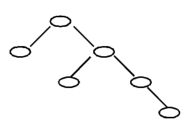

2019 年是 NOIP 转型为 CSP 的第一年，本年度的 CSP-J（入门级/普及组）初赛试卷难度适中，非常注重计算机的基础理论广度以及算法执行的模拟能力。

本文将为您**先展示真题原题，然后进行逐题深度解析**，帮助 GESP 及 CSP-J 的备考同学精准对标考点。

<!--more-->

---

## 📌 一、单项选择题（共 15 题，每题 2 分，共计 30 分；每题有且仅有一个正确选项）

### 第 1 题

> **原题：**
>
> 1. 中国的国家顶级域名是 ( )
>    A. .ch &nbsp;&nbsp;&nbsp;&nbsp;B. .china &nbsp;&nbsp;&nbsp;&nbsp;C. .cn &nbsp;&nbsp;&nbsp;&nbsp;D. .chn

**正确答案：** C

**深度解析：**
计算机网络基础常识题。中国（China）的国家顶级域名（ccTLD）官方分配为 `.cn`。
_扩展记忆：_ `.com` 为商业机构，`.edu` 为教育机构，`.gov` 为政府部门。注意，`.ch` 实际上代表的是瑞士（Confoederatio Helvetica）。

---

### 第 2 题

> **原题：** 2. 二进制数 11 1011 1001 0111 和 01 0110 1110 1011 进行逻辑与运算的结果是（ ）。
> A. 01 0010 1000 1011
> B. 01 0010 1000 0001
> C. 01 0010 1000 0011
> D. 01 0010 1001 0011

**正确答案：** C

**深度解析：**
考查二进制的 **逻辑与（AND）** 运算。运算规则为：**上下两位均为 1 时，结果才为 1，否则为 0**。
我们进行对位计算：

```text
  11 1011 1001 0111
& 01 0110 1110 1011
-------------------
  01 0010 1000 0011
```

对比选项可知，结果完美匹配 C 选项。做这类题必须在草稿纸上进行竖式对齐，切忌心算。

---

### 第 3 题

> **原题：** 3. 一个 32 位整型变量占用（ ）个字节。
> A. 32 &nbsp;&nbsp;&nbsp;&nbsp;B. 4 &nbsp;&nbsp;&nbsp;&nbsp;C. 128 &nbsp;&nbsp;&nbsp;&nbsp;D. 8

**正确答案：** B

**深度解析：**
考查存储容量单位换算。计算机中 1 个字节（Byte）包含 8 个比特位（bits）。
题干说明是“32 位”整型变量（如 C++ 中的标准 `int`）。
公式换算：$32 \div 8 = 4$ 个字节。

---

### 第 4 题

> **原题：** 4. 若有如下程序段，其中 s、a、b、c 均已定义为整型变量，且 a、c 均已赋值（c 大于 0）
> `s = a;`
> `for (b = 1; b <= c; b++) s = s - 1;`
> 则与上述程序段功能等价的赋值语句是（ ）
> A. s = a - c; &nbsp;&nbsp;&nbsp;&nbsp;B. s = b - c; &nbsp;&nbsp;&nbsp;&nbsp;C. s = a - b; &nbsp;&nbsp;&nbsp;&nbsp;D. s = s - c;

**正确答案：** A

**深度解析：**
考查基础循环与数学转化。
代码一开始 `s` 的初始值为 `a`。
接着进行一个 `for` 循环，循环变量 `b` 从 1 开始，执行到 `c` 结束，所以循环体一共执行了 `c` 次。
循环体内每次执行的操作是 `s = s - 1`。因此，一共减去了 `c` 个 1。
综合起来，等价于从初始值 `a` 中减去 `c`，即 `s = a - c`。

---

### 第 5 题

> **原题：** 5. 设有 100 个已排好序的数据元素，采用折半查找时，最大比较次数为（ ）
> A. 10 &nbsp;&nbsp;&nbsp;&nbsp;B. 6 &nbsp;&nbsp;&nbsp;&nbsp;C. 8 &nbsp;&nbsp;&nbsp;&nbsp;D. 7

**正确答案：** D

**深度解析：**
考查**折半查找（二分查找）**的时间复杂度计算。
对于长度为 $n$ 的有序数组，二分查找在最坏情况下的最大比较次数为 $\lfloor \log_2 n \rfloor + 1$。
代入 $n = 100$：
$\log_2 64 = 6$
$\log_2 128 = 7$
所以 $100$ 介于 $2^6$ 与 $2^7$ 之间，最多需要折半查找 7 次即可囊括 100 个元素。

---

### 第 6 题

> **原题：** 6. 链表不具有的特点是（ ）
> A. 所需空间与线性表长度成正比 &nbsp;&nbsp;&nbsp;&nbsp;B. 插入删除不需要移动元素
> C. 可随机访问任一元素 &nbsp;&nbsp;&nbsp;&nbsp;D. 不必事先估计存储空间

**正确答案：** C

**深度解析：**
考查链表与数组（顺序表）的数据结构差异。

- A 选项：链表每个节点单独开辟，总空间确实与长度成正比，具有该特点。
- B 选项：链表进行插入或删除操作仅需改变指针指向，不需要像数组那样挪动大量物理元素，具有该特点。
- **C 选项**：这是**数组**的特点（支持下标常数级访问 $O(1)$）。链表在内存在是非连续的，必须只能从头节点开始挨个顺着指针向后遍历（即顺序访问 $O(n)$），**不能随机访问**！所以链表不具有此特点，选 C。
- D 选项：链表是动态分配内存的，确实无需提前声明固定容量。

---

### 第 7 题

> **原题：** 7. 把 8 个同样的球放在 5 个同样的袋子里，允许有的袋子空着不放，问共有多少种不同的分法？（ ）提示：如果 8 个球都放在一个袋子里，无论是哪个袋子，都只算同一种分法
> A. 24 &nbsp;&nbsp;&nbsp;&nbsp;B. 18 &nbsp;&nbsp;&nbsp;&nbsp;C. 20 &nbsp;&nbsp;&nbsp;&nbsp;D. 22

**正确答案：** B

**深度解析：**
这是一道经典的**整数划分问题**（穷举或动态规划思维），要求将正整数 8 划分为不超过 5 个正整数相加的组合方法数量（这里不考虑袋子和球的顺序，因为都是“同一样”的）。
我们采用枚举法，按非空袋子数量从小到大枚举分配方案（设各袋子球数为序列，并保证单调递减防止重复）：

- **1 个袋子装：** `(8)`，共 1 种。
- **2 个袋子装：** `(7,1)`，`(6,2)`，`(5,3)`，`(4,4)`，共 4 种。
- **3 个袋子装：**
  - 最大值为 6：`(6,1,1)`
  - 最大值为 5：`(5,2,1)`
  - 最大值为 4：`(4,3,1)`, `(4,2,2)`
  - 最大值为 3：`(3,3,2)`
    共 5 种。
- **4 个袋子装：**
  - 最大为 5：`(5,1,1,1)`
  - 最大为 4：`(4,2,1,1)`
  - 最大为 3：`(3,3,1,1)`, `(3,2,2,1)`
  - 最大为 2：`(2,2,2,2)`
    共 5 种。
- **5 个袋子装：**
  - 最大为 4：`(4,1,1,1,1)`
  - 最大为 3：`(3,2,1,1,1)`
  - 最大为 2：`(2,2,2,1,1)`
    共 3 种。
- **汇总总分法：** 1 + 4 + 5 + 5 + 3 = **18 种**。

---

### 第 8 题

> **原题：** 8. 一棵二叉树如右图所示，若采用顺序存储结构，即用一维数组元素存储该二叉树中的结点（根结点的下标为 1，若某结点的下标为 i，则其左孩子位于下标 2i 处、右孩子位于下标 2i+1 处），则该数组的最大下标至少为（ ）。
> A. 15 &nbsp;&nbsp;&nbsp;&nbsp;B. 12 &nbsp;&nbsp;&nbsp;&nbsp;C. 10 &nbsp;&nbsp;&nbsp;&nbsp;D. 6



**正确答案：** A

**深度解析：**
结合图片中二叉树的形态进行下标连乘推导：

- 根节点下标必定为 1。
- 根节点只有右孩子，右孩子的下标为 $2 \times 1 + 1 = 3$。
- 下标为 3 的节点有一个左孩子和一个右孩子。它的左孩子下标是 $3 \times 2 = 6$，右孩子下标是 $3 \times 2 + 1 = 7$。
- 下标为 7 的这个最右侧节点，还延伸出了一个左孩子和一个右孩子。它的右孩子一定是整棵树下潜最深、下标最大的节点，计算公式为 $7 \times 2 + 1 = 15$。
  因此，若用一维数组顺序存储，要装下这个叶子节点，数组最大下标至少要开到 15 才能保障不越界。选 A。

---

### 第 9 题

> **原题：** 9. 100 以内最大的素数是（ ）。
> A. 89 &nbsp;&nbsp;&nbsp;&nbsp;B. 93 &nbsp;&nbsp;&nbsp;&nbsp;C. 91 &nbsp;&nbsp;&nbsp;&nbsp;D. 97

**正确答案：** D

**深度解析：**
判断素数常识。

- $93 = 3 \times 31$（伪素数陷阱）。
- $91 = 7 \times 13$（极其经典的伪素数陷阱，经常让同学马虎丢分）。
- 最大的一位数内看 $97$，无法被 $2, 3, 5, 7$ 等质数整除，它是质数。故 100 以内最大素数是 97。

---

### 第 10 题

> **原题：** 10. 319 和 377 的最大公约数是（ ）。
> A. 29 &nbsp;&nbsp;&nbsp;&nbsp;B. 33 &nbsp;&nbsp;&nbsp;&nbsp;C. 31 &nbsp;&nbsp;&nbsp;&nbsp;D. 27

**正确答案：** A

**深度解析：**
数学数论题。不用硬拆质因数，而是使用**更相减损术**或者**短除法/辗转相除法**思路寻找它们的公因子规律：
这两个数之间的差值为 $377 - 319 = 58$。
两个数的最大公约数必定也同时是差值 $58$ 的约数。
再将 58 分解：$58 = 2 \times 29$。
既然它们不可能是偶数（无法被 2 整除），那必然去试 $29$。
$319 \div 29 = 11$，计算完全整除。因此最大公约数为 29。

---

### 第 11 题

> **原题：** 11. 新学期开学了，小胖想减肥，健身教练给小胖制定了两个训练方案。方案一：每次连续跑 3 公里可以消耗 300 千卡（耗时半小时）；方案二：每次连续跑 5 公里可以消耗 600 千卡（耗时 1 小时）。小胖每周周一到周四能抽出半小时跑步，周五到周日能抽出一小时跑步。另外，教练建议小胖每周最多跑 21 公里，否则会损伤膝盖。请问如果小胖想严格执行教练的训练方案，并且不想损伤膝盖，每周最多能通过跑步消耗多少千卡？（ ）
> A. 3000 &nbsp;&nbsp;&nbsp;&nbsp;B. 2400 &nbsp;&nbsp;&nbsp;&nbsp;C. 2500 &nbsp;&nbsp;&nbsp;&nbsp;D. 2520

**正确答案：** B

**深度解析：**
生活模拟与基础**贪心算法**思想。
我们要找的是在 "不超过 21 公里" 和 "时间允许" 范围内，如何让千卡消耗总数最大化。
先算“性价比”：

- 方案一：$300 \div 3 = 100$ 千卡/公里。
- 方案二：$600 \div 5 = 120$ 千卡/公里（更优）。
  因此，**贪心策略是一定要尽可能多地执行方案二**以榨干这宝贵的 21 公里额度！
  方案二耗时 1 小时，只有周五、六、日（共 3 天）时间足够，所以最多跑 3 次方案二：
  共跑 $3 \times 5 = 15$ 公里，消耗 $3 \times 600 = 1800$ 千卡。
  剩下可跑额度为 $21 - 15 = 6$ 公里。
  这剩下的 6 公里刚好可以均分到周一至周四之中（只需跑 2 天），执行“方案一”（时间 0.5 小时符合条件）。
  消耗 $2 \times 300 = 600$ 千卡。
  总计消耗：$1800 + 600 = 2400$ 千卡。全利用，并且时间与限额两不误。选 B。

---

### 第 12 题

> **原题：** 12. 一副纸牌除掉大王小王有 52 张牌，四种花色，每种花色 13 张。假设从这 52 张牌中随机抽取 13 张纸牌，则至少（ ）张牌的花色一致。
> A. 4 &nbsp;&nbsp;&nbsp;&nbsp;B. 2 &nbsp;&nbsp;&nbsp;&nbsp;C. 5 &nbsp;&nbsp;&nbsp;&nbsp;D. 3

**正确答案：** A

**深度解析：**
经典的**抽屉原理（鸽巢原理）**。
有 13 只鸽子（被抽取的牌），放进 4 个抽屉（花色）里。
最倒霉、最平均分配的情况是：每个花色各抽出来 3 张。这时消耗了 $3 \times 4 = 12$ 张牌。
还剩最后 1 张关键的牌。无论这张牌属于哪个花色，必然会导致那个花色的总牌数被凑满 4 张。
所以至少会遇到 4 张花色相同的纸牌。

---

### 第 13 题

> **原题：** 13. 一些数字可以颠倒过来看，例如 0、1、8 颠倒过来还是本身，6 颠倒过来是 9，9 颠倒过来还是 6，其他数字颠倒过来都不构成数字。类似地，一些多位数也可以颠倒过来看，比如 106 颠倒过来是 901。假设某个城市的车牌只由 5 位数字组成，每一位都可以取 0 到 9。请问这个城市最多有多少个车牌颠倒过来恰好还是原来的车牌？（ ）
> A. 60 &nbsp;&nbsp;&nbsp;&nbsp;B. 125 &nbsp;&nbsp;&nbsp;&nbsp;C. 100 &nbsp;&nbsp;&nbsp;&nbsp;D. 75

**正确答案：** D

**深度解析：**
这道是包含动态映射关系的**组合数学及乘法原理**规律题。
能够翻转成立的数字池总共有 5 个字符：$\{0, 1, 8, 6, 9\}$。
车牌是由固定的 5 位数排列而成，不妨记位置为第一到第五位：`A B C D E`。
当对这个车牌翻转过来后，位置必须形成完美对称：

- **第一位被第五位倒影**：于是决定了它俩是一对绑定组合，左侧随便填 $\{0, 1, 8, 6, 9\}$中的一种即可定局（共 5 种选择），一旦第一位敲定（假设选了 6），最后面的第五位只能被锁死映射成 9；
- **第二位被第四位倒影**：同理，第二位从数字池任挑 5 个数字其中之一，第四个位置强制配合映射；（共 5 种选择）；
- **正中央的第三位**：作为中心对称点，不能和别人配合，颠倒过来必须还是它原来的模样。从池子里刨除了互相映射的 6 和 9，它只能使用**中心对称**的 **$\{0, 1, 8\}$** 来构成。它只有 3 个选择。
  所以全套配对方案的数量是：$5 \times 5 \times 3 = 75$ 种。

---

### 第 14 题

> **原题：** 14. 假设一棵二叉树的后序遍历序列为 DGJHEBIFCA，中序遍历序列为 DBGEHJACIF，则其前序遍历序列为（ ）。
> A. ABDEGJHCFI &nbsp;&nbsp;&nbsp;&nbsp;B. ABDEGHJFIC &nbsp;&nbsp;&nbsp;&nbsp;C. ABCDEFGHIJ &nbsp;&nbsp;&nbsp;&nbsp;D. ABDEGHJCFI

**正确答案：** D

**深度解析：**
二叉树基础推导必考题。唯一且绝对准确的指导思想是：**“后序序列找爹点定根，中序序列一刀劈两半”**。

1. **看后序**：末尾的最后一个字母 `A` 就是这棵树总的超级根节点。
2. **看中序**：找到 `A` 所处位置，发现它左侧被 `DBGEHJ` 切片，右侧被 `CIF` 切片。左右子树初步明确。

接着，把左半区 `DBGEHJ` 摘出来独立分析查爹法：

- 观察在这 6 个字母里的**后序序列**片段，`D G J H E B`，可以看出 `B` 是后方压阵排最后的，所以 `B` 是该左子树的大根。
- 回头去找**中序序列**验证并找左右。`B`的左侧是个非常孤立的字 `D` ；右侧剩下一串 `GEHJ`。得出这颗树由 B 出发，左边是 D，右边树杈里塞了 GEHJ 四兄弟。
- 重复剥离法继续看 `GEHJ`：在后序序列顺次查找到这段字母顺序是 `G J H E`，`E`在最尾部。所以 `E` 做了 `GEHJ` 小支线的父亲。去往 **中序列表** 找到 `E`！发现 `E`的左侧是孤立节点 `G`；右侧为 `HJ`节点对。
- 最边缘验证：在对应的后序中看到 `J H`，得知 `H` 为根节点。在中序看到 `H J` ，可见 `J` 确属后挂（即`H`的右孩子无错）。

对整棵树另一侧（右子树集合：`CIF`）用完全相同逻辑排摸发现：

- 集合后序位序列是 `I F C` ，故定该片区主父系为 `C`。
- 退察中序段 `C I F` 知 `IF` 属其纯统管的右子代组 。
- 后续里 `I F` 确以`F` 收尾，得此节点组里 `F`为头儿，中序里倒带看 `I F` 就是 `I` 被挂于其左臂。

画完草图后整合全部结构开始以“根-左-右”顺序朗读出全貌：
即 **A B D E G H J C F I**。与 D 完全对版。

---

### 第 15 题

> **原题：** 15. 以下哪个奖项是计算机科学领域的最高奖？（ ）
> A. 鲁班奖 &nbsp;&nbsp;&nbsp;&nbsp;B. 普利策奖 &nbsp;&nbsp;&nbsp;&nbsp;C. 图灵奖 &nbsp;&nbsp;&nbsp;&nbsp;D. 诺贝尔奖

**正确答案：** C

**深度解析：**
信息学软考必知常识。
由于阿兰·图灵（Alan Turing）在“算法可计算性思维及图灵机模型”上的划时代建树被誉为计算机科学的奠基人，国际上非常有声望的美国计算机协会（ACM）于 1966 年起特为此设立**图灵奖**（A.M. Turing Award）。可以说，该奖有着“计算机界诺贝尔奖”的绝对极高地位。
_防丢分排雷包：_

- 鲁班奖：专为建筑工程开设。
- 普利策奖：全美关于新闻界、最高文化和荣誉象征。
- 诺贝尔奖：虽然是科学界最高无上荣耀！但它从未下设过“计算机类别”。

---

> [!TIP]
> **本篇结语**
> 以上为 1~15 题单选题的原题与全解析。后续第二篇为阅读程序题解析，然后是第三篇的完善程序题解析，敬请期待！
